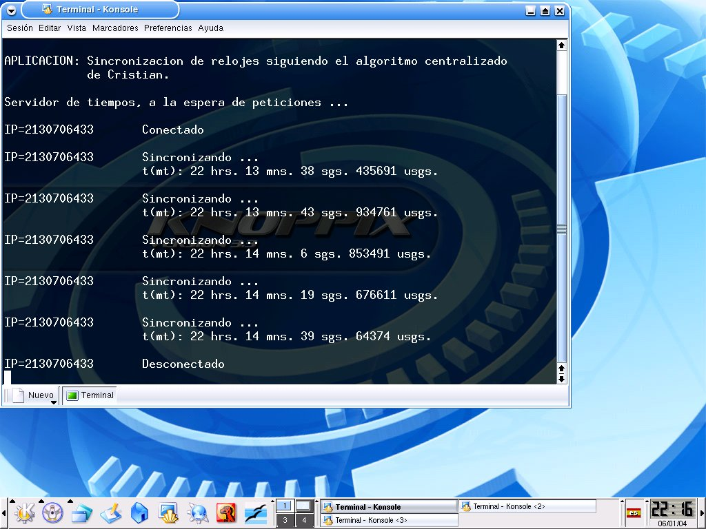

# cristian  

Cristian's algorithm implementation in C

Cristian's algorithm is a method for clock synchronisation which can be used in many fields of distributive computer science but is primarily used in low-latency intranets.

More information at:
http://en.wikipedia.org/wiki/Cristian%27s_algorithm

An example is implemented in C language using Knoppix GNU/Linux as operating system (see image). It is based on TCP/IP. TCP/IP refers to two protocols that work together to deliver data: the Transmission Control Protocol (TCP) and the Internet Protocol (IP).

Review some slides to understand the code:
http://www.csd.uoc.gr/~hy556/material/tutorials/cs556-3rd-tutorial.pdf
